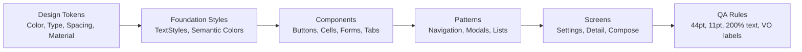

# Hệ thống thiết kế iOS theo chuẩn Apple để tái tạo “chất iOS”: Triết lý, UI/UX, quy trình, kiểm thử và QA

## Tóm tắt điều hành

Mục tiêu “trông và cảm giác như iOS” không đến từ việc bắt chước UI của các app hệ thống, mà đến từ việc **tuân thủ nguyên tắc thiết kế nền tảng + dùng đúng thành phần hệ thống + kiểm thử đúng tiêu chí**. Apple nhấn mạnh trải nghiệm tốt phải dựa trên nền tảng thiết kế giao diện vững (đọc được, rõ ràng, tương tác phù hợp chạm, tương phản đủ, spacing hợp lý…). citeturn25view0

Ba “trục” giúp tái tạo phong cách iOS một cách bền vững (đặc biệt trong bối cảnh iOS 26 và thiết kế “Liquid Glass” lan tỏa toàn hệ sinh thái):

- **Tư duy thiết kế**: nội dung là trung tâm, UI phục vụ và “lùi lại” (deference), ưu tiên rõ ràng/đọc được (clarity), và dùng lớp/độ sâu/motion để biểu đạt phân cấp (depth). citeturn15view0  
- **Ngôn ngữ thị giác + quy ước nền tảng**: dùng text styles/Dynamic Type, semantic colors, SF Symbols; tôn trọng safe area & layout margins; kiểm soát touch target tối thiểu **44×44pt** và cỡ chữ UI tối thiểu **11pt**; tránh tùy biến phá vỡ hành vi hệ thống (đặc biệt với navigation/toolbar nền “glass”). citeturn25view0turn34view0turn32view4  
- **QA & đo lường**: kiểm thử usability (định tính) + A/B (định lượng) + UI automation + performance + accessibility. Apple cung cấp bộ tiêu chí đánh giá cho Accessibility Nutrition Labels (VoiceOver, Larger Text, Reduced Motion, Sufficient Contrast…) rất hữu ích để biến “accessibility” thành checklist QA cụ thể. citeturn19view0turn19view2turn19view3turn19view1turn5search1

Báo cáo này cung cấp:
- Khung triết lý và nguyên tắc (HIG + logic đằng sau).
- Hướng dẫn chi tiết từ typography, màu, blur/translucency, icon, spacing đến motion/feedback.  
- Quy trình thiết kế end-to-end (discovery → flows → wireframe → hi‑fi → prototype → handoff).  
- Bộ thực hành kiểm thử/QA (kèm bảng checklist QA) và tiêu chí App Store (kèm bảng “HIG vs lệch thường gặp”).  
- Template mẫu (style guide, component library, checklist) + một màn hình mẫu theo phong cách iOS (kèm code SwiftUI/UIKit).

## Triết lý thiết kế và nguyên tắc HIG

### Ba “theme” nền cho trải nghiệm iOS

Apple từng mô tả 3 chủ đề (themes) cốt lõi của iOS 7—và chúng vẫn là nền tư duy để bạn “làm ra chất iOS” hôm nay:

- **Deference (tôn trọng nội dung)**: UI giúp hiểu và tương tác với nội dung, nhưng không cạnh tranh với nội dung. citeturn15view0  
- **Clarity (rõ ràng/đọc được)**: chữ dễ đọc ở mọi cỡ, icon chính xác “lucid”, trang trí tinh tế, tập trung vào chức năng. citeturn15view0  
- **Depth (độ sâu)**: lớp thị giác và motion “thật” giúp người dùng hiểu phân cấp và ngữ cảnh. citeturn15view0  

**Rationale để tái tạo**: Nếu bạn tối ưu mọi quyết định UI theo 3 trục này (nội dung trước, rõ ràng trước, phân cấp trước), giao diện sẽ tự nhiên “giống iOS” hơn so với việc copy màu/bo góc.

### Thiết kế mới và “Liquid Glass” như một lớp phân cấp

Từ WWDC25, Apple giới thiệu chương mới của hệ thống thiết kế: cập nhật thị giác, kiến trúc và component, “gắn lại” bởi Liquid Glass. citeturn32view2

Apple mô tả Liquid Glass là **material động** kết hợp “tính quang học của kính” với “cảm giác fluid”. citeturn16search0  
Trong hướng dẫn về materials, Apple nhấn mạnh việc dùng blur/vibrancy/blending để tạo cảm giác cấu trúc và phân cấp giữa lớp điều hướng/controls với lớp nội dung. citeturn16search1turn20search13

Quan sát từ gallery “new design”: ví dụ một app đưa màu thương hiệu từ toolbar vào lớp nội dung để “nội dung tỏa sáng qua controls”—đúng tinh thần deference + phân lớp. citeturn32view1

### “Giống iOS” không đồng nghĩa “copy app iOS”

Về mặt phân phối, App Review nhấn mạnh App Store là hệ sinh thái curated, mọi app được review theo 5 nhóm guideline (Safety, Performance, Business, Design, Legal). citeturn12search7  
Trong mục Design, Apple nêu rõ “đừng copy” (4.1 Copycats) và đừng chỉ “repackage website”; cần có giá trị/utility/quality xứng đáng. citeturn12search7  

Điều này ảnh hưởng trực tiếp đến chiến lược “replicate style”: bạn **có thể** theo HIG về conventions và component, nhưng **không nên** bê nguyên layout/flow đặc thù của app phổ biến rồi đổi tên.

## Ngôn ngữ thị giác iOS

### Typography: hệ text styles + Dynamic Type là “xương sống”

Apple xem **text styles** là cốt lõi để tạo UI đẹp và nhất quán: chúng là tổ hợp predefined của font weight + point size + leading để tạo phân cấp typography. citeturn35view0  
Dynamic Type cho phép người dùng điều khiển cỡ chữ theo nhu cầu; Apple khuyến nghị bạn nên hỗ trợ vì lợi ích accessibility. citeturn35view0  

Apple cũng mô tả “optical sizes” của San Francisco: SF Text cho cỡ chữ nhỏ dưới ~20pt; SF Display cho cỡ lớn (>=20pt) để tối ưu legibility. citeturn35view0  

Về cỡ chữ UI tối thiểu: Apple khuyến nghị chữ trong UI nên **>= 11pt** để đọc được ở khoảng cách xem thông thường mà không cần zoom. citeturn25view0  

**Type scale tham khảo (mặc định iOS 17, ở mức sizing mặc định)**: bảng dưới hữu ích để thiết lập style guide/design tokens; lưu ý point size thực tế thay đổi theo Content Size Category (Dynamic Type) và có thể thay đổi theo iOS. citeturn37view0turn35view0  

| TextStyle | Point size mặc định | Gợi ý sử dụng trong UI |
|---|---:|---|
| extraLargeTitle | 36 | Display/hero title (ít dùng) citeturn37view0 |
| extraLargeTitle2 | 28 | Display title cấp 2 citeturn37view0 |
| largeTitle | 34 | Title màn hình/section lớn citeturn37view0 |
| title1 | 28 | Heading chính trong nội dung citeturn37view0 |
| title2 | 22 | Heading phụ citeturn37view0 |
| title3 | 20 | Heading nhỏ citeturn37view0 |
| headline | 17 (Semibold) | Nhấn mạnh trong cell/section citeturn37view0 |
| body | 17 | Nội dung chính citeturn37view0 |
| callout | 16 | Phụ trợ/annotation citeturn37view0 |
| subheadline | 15 | Secondary text citeturn37view0 |
| footnote | 13 | Meta/help nhỏ citeturn37view0 |
| caption1 | 12 | Caption citeturn37view0 |
| caption2 | 11 | Caption nhỏ (cẩn trọng về legibility) citeturn37view0 |

### Màu sắc: semantic colors + tự thích nghi theo chế độ và accessibility

Apple khuyến nghị nền tảng màu nên dựa trên **system-defined colors** vì chúng nhìn tốt trên nhiều nền/appearance modes và có thể tự thích nghi với vibrancy & accessibility settings. citeturn20search3  
Trong UIKit, nhóm “UI element colors” (ví dụ `systemBackground`, `secondarySystemBackground`…) được đặt tên theo “intended use” để bạn dùng đúng ngữ nghĩa thay vì hardcode. citeturn20search20turn20search0turn20search6  

Trong thực hành “giống iOS”, hãy dùng:
- Text: `.label`, `.secondaryLabel` (UIKit) hoặc `.primary/.secondary` (SwiftUI, thường map sang label colors). citeturn20search20turn20search14  
- Background: `.systemBackground`, `.secondarySystemBackground`, `.tertiarySystemBackground` để tạo phân cấp mặt phẳng. citeturn20search6turn20search0  
- Tint: ưu tiên tint system (ví dụ `.systemBlue`) cho hành vi/nhận diện “iOS‑like”, sau đó mới layer màu thương hiệu một cách có kiểm soát (không phá contrast).

### Materials: blur/translucency, vibrancy, “glass” và phân lớp

Apple nhấn mạnh dùng materials/effects chuẩn (blur, vibrancy, blending) để truyền tải cấu trúc và giúp người dùng giữ “sense of place” giữa nội dung và controls. citeturn16search1turn20search13  
Liquid Glass được mô tả như vật liệu động, kết hợp thuộc tính quang học của kính với cảm giác fluid. citeturn16search0  
Trong SwiftUI, khi dùng `Material`, foreground có **vibrancy** (blend theo ngữ cảnh) để tăng tương phản. citeturn16search11  

Một thay đổi quan trọng khi tái tạo style theo iOS 26: toolbar/navigation bar có nền “glass”/trong suốt mặc định; Apple khuyến nghị **gỡ custom background** vì `UIBarAppearance`/`backgroundColor` có thể “interfere” với glass appearance. citeturn32view4  

image_group{"layout":"carousel","aspect_ratio":"16:9","query":["Apple Liquid Glass iOS 26 UI material","iOS 26 navigation bar transparent glass appearance","Apple Design new design gallery Liquid Glass examples","SF Symbols 7 library icons preview"],"num_per_query":1}

### Iconography: SF Symbols + grid logic + khả năng localization

SF Symbols 7 là thư viện **> 6.900 symbol**, tích hợp chặt với San Francisco; symbol có **9 weights** và **3 scales**, tự align theo text, hỗ trợ export/edit vector để tạo custom symbols cùng đặc tính thiết kế và accessibility. citeturn33view0  

Trong WWDC19, Apple nhấn mạnh: “symbol point sizes” là **typographic** (giống font size), không phải kích thước ảnh theo pixel/point; vì vậy **đừng ép width/height** cho symbol nếu không cần—hãy để “natural size” để align quang học với text và tránh hiển thị sai/giảm performance. citeturn33view1  

Về localization: Apple hỗ trợ localized SF system symbols và directionality phù hợp các ngôn ngữ (kể cả RTL). citeturn18view0  
WWDC22 RTL cũng giải thích quy tắc đặt tên symbol: nhóm “forward/backward” thường **flip theo RTL**, còn “left/right” biểu đạt hướng tuyệt đối nên **không flip**—rất quan trọng khi bạn chọn icon mũi tên cho navigation. citeturn18view1  

### Spacing và layout: safe area, margins, “system spacing” thay vì đoán

Apple khuyến nghị dùng layout phù hợp màn hình và tránh scroll ngang; các quy tắc về touch controls, hit targets, text size, contrast… là “fundamental interface design concepts” trước khi code. citeturn25view0  

Trong Tech Talk “Designing for iPhone X”, Apple giải thích:
- Dùng **Safe Area layout guide** để tránh underlap bars và tránh clipping bởi notch/rounded corners/home indicator. citeturn34view0  
- Background materials có thể extend ra mép màn hình; nhưng controls/content quan trọng nên inset theo safe area/margins. citeturn34view0  

Trong Auto Layout Guide (archive), Apple mô tả “standard spacing” của Interface Builder: mặc định **20pt từ view đến edge**, và **8pt giữa sibling views**; đồng thời root view margins thường là **16 hoặc 20pt** tùy thiết bị. citeturn36view4  

Ngoài ra, Apple cung cấp API “system spacing” (constraint theo hệ số nhân) để bạn bám theo spacing chuẩn hệ thống thay vì cố định. citeturn21search0turn21search12  

### Touch targets và khả năng chạm “đúng iOS”

Apple khuyến nghị:
- **Hit target tối thiểu 44×44pt** để chạm chính xác bằng ngón tay. citeturn25view0  
- Tránh đặt controls sát mép vì khó reach; dùng safe area + layout margins để quyết định inset phù hợp. citeturn34view0  

## Mẫu tương tác và quy ước nền tảng

### Navigation: tab bar, hierarchy, modality

WWDC22 “Explore navigation design for iOS” nhấn mạnh tab bar là **global navigation** ở đáy màn hình, phản ánh top-level hierarchy; tab label nên “kể câu chuyện” về chức năng và giúp người dùng dự đoán nơi họ sẽ đến. citeturn24view4  
Video cũng cảnh báo anti-pattern: nhồi mọi chức năng vào một tab làm người dùng phải scroll nhiều và khó parse các mục không liên quan; thay vào đó, phân chia theo “Why do people use your app?” và phân phối tính năng hợp lý giữa các tab. citeturn24view4  

Trong iOS 26 (theo WWDC25 UIKit session), large title gắn với scroll content “đặt ở top của content scroll view” và scroll cùng content; để title hiển thị đúng, cần extend scroll view dưới navigation bar. citeturn32view4  

### States & feedback: nhất quán với component hệ thống

Để “giống iOS”, ưu tiên component hệ thống vì chúng đã có state model chuẩn. UIKit mô tả control có các state như normal, highlighted, focused, selected, disabled… và hệ thống sẽ mô hình hóa phản hồi phù hợp theo state. citeturn23search2turn23search10  

Về haptics/feedback, Apple hướng dẫn dùng haptic như một phần của feedback đa kênh (visual/audio/haptic) để người dùng nhận được phản hồi trong nhiều điều kiện. citeturn8search3turn8search6  

### Accessibility “ngay từ thiết kế”: VoiceOver, Larger Text, Contrast, Reduce Motion

Apple cung cấp bộ “evaluation criteria” rất thực dụng để bạn QA:

- **VoiceOver**: người dùng phải có thể navigate và tương tác mọi elements (text/media/buttons/controls) chỉ bằng VoiceOver; mọi controls cần label ngắn gọn, chính xác; thông tin về type/state/value phải được công bố qua traits/API phù hợp; custom controls phải đạt mức tương đương native controls. citeturn19view0  
- **Larger Text**: nên hỗ trợ phóng to text tối thiểu **200%** so với mặc định (qua Dynamic Type hoặc control trong app). citeturn19view2  
- **Sufficient Contrast**: mục tiêu hỗ trợ người dùng thị lực giảm hoặc tình huống sáng gắt; cần đảm bảo icon/text đủ tương phản so với nền. citeturn19view1  
- **Reduced Motion**: không nên “tắt sạch animation” nếu motion mang ý nghĩa (status change, hierarchical transition); thay vào đó dùng animation ít gây motion (dissolve, highlight fade, color shift). citeturn19view3  

### Localization & RTL: đừng chỉ dịch chữ

Apple mô tả quy trình localization: Xcode tách user-visible strings/assets thành resource files; asset catalog có thể localize image; có thể dùng localized SF symbols và set directionality cho custom symbols; app nên chấp nhận user-generated text nhiều ngôn ngữ; và iOS/iPadOS cho phép người dùng chọn ngôn ngữ của app độc lập ngôn ngữ hệ thống. citeturn18view0  

WWDC22 RTL giải thích phần lớn RTL “comes for free”, nhưng bạn vẫn phải chú ý text/image/control orientation, và dùng các chế độ test như “Right-to-Left Pseudolanguage” để phát hiện layout sai. citeturn18view1  

## Quy trình thiết kế end-to-end

### Quy trình chuẩn iOS app: từ discovery đến handoff

Apple không công bố “đúng 1 quy trình nội bộ” cho mọi team, nhưng Apple liên tục cung cấp thực hành và tooling để bạn xây quy trình thiết kế iOS hiệu quả:

- Dùng **Apple Design Resources** để thiết kế “accurately and quickly” với template/UI kit chính thức (có UI kit cho iOS 26 & iPadOS 26 ở cả Figma và Sketch). citeturn17view4turn26view0  
- Áp dụng vòng lặp thiết kế—prototype nhanh—test—iterate. WWDC17 nhấn mạnh lợi ích của prototype tương tác thay vì “chốt code sớm” hoặc vẽ static mock không tương tác. citeturn24view2  
- Xem SwiftUI như “design tool”: Apple designers (Maps team) mô tả họ thiết kế trực tiếp bằng SwiftUI, kiểm soát spacing, typestyles, animations và interactions, giúp validate ý tưởng nhanh và test như app thật trên thiết bị. citeturn24view3  

### Mermaid: luồng quy trình thiết kế và bàn giao

```mermaid
flowchart TD
  A[Discovery & Problem framing] --> B[IA & User flows]
  B --> C[Wireframe / Low-fi]
  C --> D[Design system: tokens + components]
  D --> E[Hi-fi screens]
  E --> F[Prototype tương tác]
  F --> G[Usability test + Accessibility audit]
  G --> H[Iterate: refine flows, copy, visuals]
  H --> I[Developer handoff: specs + assets + states]
  I --> J[Implementation (SwiftUI/UIKit)]
  J --> K[QA: functional + UI automation + perf + a11y]
  K --> L[App Store submission & review]
  L --> H
```

### Handoff “đúng kiểu iOS”: những thứ phải bàn giao

Để dev build ra UI “đúng chuẩn iOS”, handoff nên là **hệ thống spec**, không chỉ là ảnh:

- **Tokens**: semantic colors, typography styles, spacing rules, corner radius policy, material policy (khi nào dùng blur/glass, khi nào không). Apple cung cấp UI kit và template chính thức để bạn bám theo kích thước/behavior của hệ thống. citeturn17view4turn26view0  
- **Component states**: normal/pressed/disabled/loading/error; rules về focus/VoiceOver labels. citeturn19view0turn23search10  
- **Platform constraints**: iOS 26 khuyến nghị gỡ custom background cho navigation/toolbar để không phá glass appearance. citeturn32view4  
- **Localization matrix**: danh sách locale cần hỗ trợ, RTL strategy, icon mirroring rule (forward/backward vs left/right). citeturn18view1turn18view0  

## Kiểm thử, đo lường và QA

### Usability testing: định tính để tìm “vì sao người dùng kẹt”

Remote usability testing (moderated và unmoderated) là cách phổ biến để lấy insight khi khó tổ chức lab/in-person; NN/g mô tả hai kiểu này và khi nên dùng. citeturn7search0  
Một metric đơn giản nhưng rất hữu ích để lượng hóa: **task success rate** (tỉ lệ hoàn thành nhiệm vụ), được NN/g xem là metric “đáy” và dễ hiểu. citeturn7search3  

Gợi ý áp dụng cho iOS-style QA: viết kịch bản task bám theo flows chính (onboarding, tìm kiếm, tạo/sửa/xóa, thanh toán nếu có…), đo success rate + ghi lỗi UI (mis-tap, không đọc được, khó hiểu icon/button).

### A/B testing: định lượng để tối ưu theo mục tiêu rõ ràng

NN/g định nghĩa A/B testing là phương pháp định lượng: test 2+ biến thể với audience thật để xem biến thể nào tốt hơn theo metric đã chọn trước. citeturn7search1  

Với hệ sinh thái Apple, một năng lực “A/B official” rất mạnh là **Product Page Optimization**: bạn có thể test icon/screenshot/app preview trên App Store, tối đa 3 treatments so với bản gốc và xem kết quả trong App Analytics; người dùng bị random vào treatment và sẽ thấy nhất quán trong suốt test. citeturn27view0  
Về vận hành: test chạy tối đa 90 ngày; cần đảm bảo metadata được App Review approve trước khi chạy. citeturn27view1  

### UI automation: tự động hóa UI + chạy đa locale/thiết bị/cấu hình

WWDC25 “Record, replay, and review: UI automation with Xcode” nêu rõ bạn có thể:
- record/run/maintain XCUIAutomation tests,
- replay UI tests trên “dozens of locales, device types, system conditions” bằng test plans,
- review bằng Xcode test report và tải video/screenshot của mỗi run. citeturn31view0  

Đây là chìa khóa để QA “giống iOS” trên nhiều điều kiện: dark/light, text size lớn, RTL, reduce motion…

### Performance & reliability: đo theo cách Apple đo

Apple nhấn mạnh sử dụng Xcode Organizer để xem metrics/diagnostics aggregate từ thiết bị người dùng (consented), giúp ưu tiên tối ưu. citeturn31view1  
Trong WWDC20 Organizer talk, Apple còn mô tả “scroll hitches” và cách diễn giải hitch rate (ví dụ >10ms/s có thể gây trải nghiệm scroll tệ). citeturn31view1  

Với MetricKit, Apple cung cấp diagnostics cho crash/hang; WWDC20 nêu mỗi lần crash sẽ có MXCrashDiagnostic với exception info, termination reason, memory region info và backtrace. citeturn31view2  

Ngoài ra, XCTest hỗ trợ performance tests qua `measure(_:)` và các metrics liên quan. citeturn30search1turn29search0  

### Accessibility testing: biến “a11y” thành test cases cụ thể

Bộ tiêu chí Accessibility Nutrition Labels giúp bạn QA theo “common tasks”:

- VoiceOver: label/traits, operability, custom actions… citeturn19view0  
- Larger Text: 200%+ và giữ usable layout. citeturn19view2  
- Reduced Motion: thay animation bằng biến thể ít motion khi cần. citeturn19view3  
- Sufficient Contrast: đảm bảo đọc được trong điều kiện thị lực giảm/ánh sáng mạnh. citeturn19view1  

Công cụ đo contrast: WWDC19 Accessibility Inspector nhắc contrast ratio khuyến nghị “above 3.0” trong calculator của tool (lưu ý: tùy loại nội dung, bạn vẫn nên đối chiếu thêm với chuẩn WCAG nếu app thuộc nhóm rủi ro cao). citeturn6search15  

### Bảng checklist QA theo chuẩn iOS

| Hạng mục QA | Tiêu chí đạt | Cách test (ví dụ) | Tool/nguồn chuẩn |
|---|---|---|---|
| Tap target | Control **>= 44×44pt** | Measure frame/overlay grid; test mis-tap | Apple UI Design Dos & Don’ts citeturn25view0 |
| Cỡ chữ tối thiểu | Text UI **>= 11pt** (trừ các trường hợp đặc biệt) | Audit các label/caption; test ngoài trời | Apple UI Design Dos & Don’ts citeturn25view0 |
| Dynamic Type | Layout không vỡ; text scale hợp lý | tăng text size; kiểm tra truncation/overlap | Larger Text criteria citeturn19view2 |
| VoiceOver | Common tasks làm được chỉ với VoiceOver; labels/traits chuẩn | chạy task end-to-end; check rotor/actions | VoiceOver criteria citeturn19view0 |
| Contrast | Text/icon đủ tương phản trên nền | check light/dark + tăng contrast | Sufficient Contrast criteria + tool guidance citeturn19view1turn6search15 |
| Reduced Motion | Motion có biến thể “ít motion” khi bật Reduce Motion | bật Reduce Motion; kiểm tra transition | Reduced Motion criteria citeturn19view3 |
| Safe area & margins | Không bị notch/home indicator che; content inset đúng | test nhiều device/orientation | iPhone X design talk citeturn34view0 |
| Navigation conventions | Tab/hierarchy/modals đúng kỳ vọng | test “back”, swipe gesture, sheet dismissal | WWDC22 navigation citeturn24view4 |
| iOS 26 glass bars | Không custom background phá “glass” | remove UIBarAppearance overrides; regression check | WWDC25 UIKit new design citeturn32view4 |
| UI automation stability | Test chạy đa locale/config ổn định | test plan: locales, dark mode, text size | WWDC25 UI automation citeturn31view0 |
| Scroll performance | Hitch rate thấp; không jank | profile + monitor metrics by version | Xcode Organizer talk citeturn31view1 |

## Tiêu chí đánh giá cho App Store và kiểm định UX

### Các nhóm tiêu chí App Review ảnh hưởng trực tiếp đến UI/UX

Apple mô tả App Store review tập trung vào trải nghiệm an toàn và chất lượng; guidelines được tổ chức theo 5 phần (Safety, Performance, Business, Design, Legal). citeturn12search7  

Các điểm “hay vấp” liên quan UI/UX:

- **4.1 Copycats**: không sao chép app phổ biến, không chỉ đổi tên/đổi chút UI; phải có ý tưởng và giá trị riêng. citeturn12search7  
- **4.2 Minimum Functionality / “app-like”**: app phải có chức năng/utility thực; không chỉ là website bọc lại; nếu không hữu ích/đủ “app‑like” có thể không được chấp nhận. citeturn12search7  
- **Accurate metadata (2.3)**: description/screenshot/preview phải phản ánh đúng core experience; tính năng ẩn/dormant có thể bị reject. citeturn12search7  

### Bảng so sánh: khuyến nghị (HIG / Apple guidance) vs lệch thường gặp

| Chủ đề | Khuyến nghị theo Apple | Lệch thường gặp | Hệ quả | Cách sửa “đúng iOS” |
|---|---|---|---|---|
| Touch targets | >= 44×44pt citeturn25view0 | Icon nút nhỏ không có “invisible hit area” | mis‑tap, fail accessibility | tăng hit area, giữ visual nhỏ nhưng tappable lớn |
| Typography | dùng text styles + Dynamic Type citeturn35view0turn19view2 | hardcode font size; layout vỡ khi text lớn | fail Larger Text/usability | chuyển sang text styles; layout co giãn |
| Semantic colors | dùng system/semantic colors citeturn20search3turn20search20 | hardcode #000/#FFF; dark mode “toang” | giảm legibility/contrast | map màu thương hiệu → semantic token + fallback |
| Materials / glass | dùng materials chuẩn; tránh phá glass citeturn20search13turn32view4 | overlay blur nặng everywhere; custom nav background | giảm clarity, tốn hiệu năng | giới hạn glass ở lớp controls; giữ content rõ |
| SF Symbols | dùng symbol align theo text; tránh ép size citeturn33view1turn33view0 | set width/height cố định, lệch baseline | icon lệch, kém “iOS feel” | cấu hình bằng point size/scale; để natural size |
| RTL & localization | dùng localized symbols + RTL support citeturn18view0turn18view1 | icon mũi tên/chevron không flip đúng | mơ hồ direction, sai nghĩa | chọn symbol “forward/backward” đúng ngữ cảnh; test RTL pseudo |
| Motion | giảm motion khi bật Reduce Motion citeturn19view3 | animation dài, full‑screen motion | chóng mặt, giảm usability | cung cấp dissolve/fade/color shift |
| Navigation | tab bar phản ánh top-level hierarchy citeturn24view4 | nhồi mọi thứ vào 1 tab; tab label mơ hồ | khó hiểu, cognitive load | tái cấu trúc IA; phân phối tính năng theo intent |
| App originality | không copy UI/flow “đặc sản” app khác citeturn12search7 | “clone” app hot, đổi màu | rủi ro reject 4.1 | giữ conventions nhưng tạo value proposition & IA riêng |

## Template mẫu và màn hình ví dụ theo style iOS

### Template style guide “chuẩn iOS”

Bạn có thể copy cấu trúc sau vào Notion/Confluence:

**Phần nền tảng**
- Mục tiêu UX: clarity/deference/depth (định nghĩa theo app của bạn).
- Conventions: tab/hierarchy/modals; safe area & margins; dark/light.

**Typography**
- Danh sách text styles dùng trong app (largeTitle/title/headline/body/footnote…).
- Quy tắc: không dùng size < 11pt trừ khi có lý do và được QA. citeturn25view0  
- Dynamic Type: yêu cầu layout không vỡ ở mức 200%+. citeturn19view2  

**Colors**
- Semantic tokens (ví dụ: `Text/Primary = .label`, `BG/Base = .systemBackground`, …). citeturn20search20turn20search6  
- Tint policy: system blue hay brand tint; quy tắc contrast. citeturn19view1  

**Materials**
- Khi nào dùng material glass/blur (chỉ lớp controls/overlays).
- Quy tắc không phá glass bars ở iOS 26 (không override bar backgrounds nếu không cần). citeturn32view4  

**Iconography**
- SF Symbols: weights/scales; quy tắc chọn symbol RTL. citeturn33view0turn18view1  
- App icon: dùng template Apple Design Resources; safe zone. citeturn17view4turn22search22  

**Accessibility**
- Checklist theo VoiceOver/Larger Text/Reduced Motion/Contrast; định nghĩa “common tasks”. citeturn19view0turn19view2turn19view3turn19view1  

### Template component library

Định nghĩa mỗi component theo format:

- **Tên component** (ví dụ: Primary Button)
- **Variants** (filled, tinted, plain…)
- **States** (default/pressed/disabled/loading)
- **Content rules** (label length, icon optional)
- **Layout rules** (min height 44pt, padding theo margins, multiline wrap)
- **Accessibility** (label/hint/traits; VoiceOver rotor actions nếu cần)

Nguồn để “khóa size/shape” nhanh: dùng UI Kit chính thức (Apple Design Resources) cho iOS 26 để bám đúng metrics/spacing của hệ thống. citeturn17view4turn26view0  

### Mermaid: quan hệ tokens → components → screens



### Màn hình mẫu theo phong cách iOS: “Cài đặt tài khoản”

**Mục tiêu**: một màn hình dạng Settings (rất “iOS-native”), nhấn mạnh readability, spacing, và accessibility.

**Spec hành vi**
- Navigation title: “Tài khoản” (large title).
- Nội dung dạng grouped list gồm 3 section: Hồ sơ, Thông báo, Bảo mật.
- Các row tappable tối thiểu 44pt; icon SF Symbols ở leading; secondary text dùng `.secondaryLabel`/`.secondary`.
- Không hardcode màu nền: dùng `systemGroupedBackground`/`systemBackground` và semantic text colors. citeturn20search6turn20search0turn20search20  
- Nếu iOS 26: không override background của navigation bar/toolbar để không phá glass. citeturn32view4  

#### SwiftUI (mẫu tham khảo)

```swift
import SwiftUI

struct AccountSettingsView: View {
    var body: some View {
        NavigationStack {
            List {
                Section {
                    HStack(spacing: 12) {
                        Image(systemName: "person.crop.circle.fill")
                            .font(.title2)
                            .symbolRenderingMode(.hierarchical)

                        VStack(alignment: .leading, spacing: 2) {
                            Text("Nguyễn Văn A")
                                .font(.headline)
                            Text("Premium • Hết hạn 12/2026")
                                .font(.subheadline)
                                .foregroundStyle(.secondary)
                        }
                    }
                    .padding(.vertical, 4)
                    .accessibilityElement(children: .combine)
                }

                Section("Thông báo") {
                    Toggle(isOn: .constant(true)) {
                        Label("Thông báo đẩy", systemImage: "bell")
                    }
                    Toggle(isOn: .constant(false)) {
                        Label("Email marketing", systemImage: "envelope")
                    }
                }

                Section("Bảo mật") {
                    NavigationLink {
                        Text("Đổi mật khẩu")
                    } label: {
                        Label("Đổi mật khẩu", systemImage: "key")
                    }

                    Button(role: .destructive) {
                        // logout
                    } label: {
                        Label("Đăng xuất", systemImage: "rectangle.portrait.and.arrow.right")
                    }
                }
            }
            .navigationTitle("Tài khoản")
        }
    }
}
```

#### UIKit (mẫu “đúng iOS feel” với `UIButton.Configuration` + semantic colors)

```swift
import UIKit

final class AccountSettingsViewController: UITableViewController {

    override func viewDidLoad() {
        super.viewDidLoad()
        title = "Tài khoản"
        tableView.backgroundColor = .systemGroupedBackground
    }

    private func makePrimaryButton(title: String) -> UIButton {
        var config = UIButton.Configuration.filled()
        config.title = title
        config.cornerStyle = .large
        config.baseBackgroundColor = .systemBlue // có thể map tint theo brand
        config.baseForegroundColor = .white

        let button = UIButton(configuration: config)
        // đảm bảo hit target tối thiểu 44pt
        button.heightAnchor.constraint(greaterThanOrEqualToConstant: 44).isActive = true
        return button
    }
}
```

### Gợi ý test cases cho màn hình mẫu (để bạn đưa vào QA/TestRail)

- **VoiceOver**: bật VoiceOver, đảm bảo focus đọc đúng “Nguyễn Văn A, Premium …”, Toggle đọc đúng state On/Off, “Đăng xuất” đọc đúng role destructive. (Dựa theo VoiceOver criteria về labels + state/value). citeturn19view0  
- **Larger Text**: bật Larger Text lên mức rất lớn; không bị overlap/truncation khiến không hoàn thành task. citeturn19view2  
- **Reduced Motion**: bật Reduce Motion; nếu có transition tùy biến, dùng fade/dissolve thay motion mạnh. citeturn19view3  
- **Hit targets**: mọi row/toggle/button đều tappable dễ dàng (>=44pt). citeturn25view0  
- **RTL**: chuyển RTL pseudolanguage; icon mũi tên chọn đúng loại “forward/backward” vs “left/right”; layout mirror không vỡ. citeturn18view1